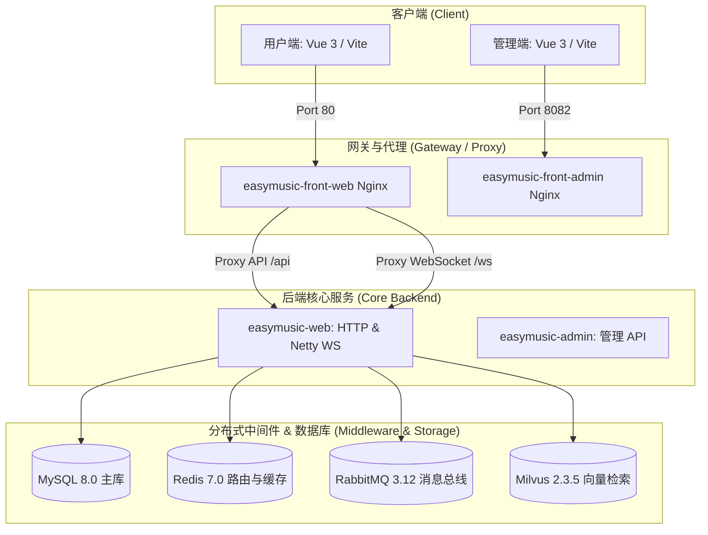

# 🎵 EasyMusic (易乐) — 智能AI音乐创作与高并发实时通信平台

[]()
[]()
[]()
[]()
[]()
[]()

`EasyMusic (易乐)` 是一款集 **AI 音乐个性化创作、智能推荐、社交聊天与歌曲点评** 于一体的现代化 Web 3.0 音乐互动平台。项目采用前沿的 AI 智能体（Agent）设计，结合高性能网络通信架构与高可靠性分布式系统设计，致力于提供极致流畅的 AI 生成式音乐体验。

---

## 🏗 系统架构与核心技术拓扑

本系统采用经典的分层分布式架构，融合了消息驱动设计（Event-Driven）与向量检索增强生成（RAG）：



---

## 🌟 核心功能与技术亮点

### 1. ⚡ 高并发 Netty + WebSocket 实时通信与流式传输引擎
基于 Netty 构建统一的 WebSocket 实时通信引擎（运行在独立端口 `8099`），单节点支撑万级并发。
- ** Reactor 线程模型调优**：`bossGroup` 负责处理连接接入，`workerGroup` 配合 `PooledByteBufAllocator` 进行内存池化管理。调优 TCP 参数（`SO_BACKLOG = 1024`, `SO_KEEPALIVE = true`, `TCP_NODELAY = true`）最大化提升网络吞吐量，降低传输时延。
- **精细化连接管理**：采用 `IdleStateHandler` 进行 60 秒心跳检测与空闲剔除，秒级关闭非活跃连接，防止无效连接堆积占用系统文件描述符（FD）。
- **统一通道流式复用**：Netty 通道不仅承载 IM 私聊与点评弹幕广播，还复用作 **AI Agent 推理思考链（CoT）与生成结果的 Streaming 分块传输通道**。客户端可实时感知 AI 的推演思维逻辑（CoT 实时显示），保障低延迟流畅交互。
- **异步性能解耦**：将 AI Agent 的 RAG 检索（Milvus）与大模型推理等同步高耗时操作彻底 **offload 出 Netty Reactor 线程**，提交到异步公共线程池执行，确保通信底座的无锁与非阻塞高性能表现。

### 2. 🤖 个性化推荐 Agent 模块 (RAG Agent)
基于 LangChain4j 构建音乐风格推荐智能体，在用户开启创作时主动推荐定制化灵感。
- **RAG 检索增强生成**：将平台优秀创作的 Prompt、风格标签通过本地 BGE 模型结合 ONNX Runtime 加速生成 512 维向量，同步存储于 **Milvus 向量数据库** 中，根据用户的偏好画像进行 Top-K 近似最近邻检索（ANN Search）召回相似创作作为大模型上下文。
- **点赞行为防抖与增量画像提炼**：通过 RabbitMQ 延迟队列对点赞行为进行 30 秒防抖合并处理。基于 `last_action_id` 游标实现**增量特征提炼**，驱动 Kimi 大模型仅提炼新增行为的偏好变化，避免全量重新计算造成的算力与 Token 浪费。

### 3. 📬 分布式路由与可靠消息投递 (Outbox Pattern)
保障在线 / 离线消息的绝对可靠处理与跨节点多端同步，解决分布式环境下的消息丢失与乱序问题。
- **分布式路由表**：基于 Redis 维护全局动态连接路由表 `im:route:{userId} -> {nodeAddress}`，精准定位用户所在节点。每个 Netty 节点在启动时动态绑定 RabbitMQ 专属路由，确保跨节点消息的精准定位与投递。
- **RabbitMQ 发送端异步 Confirm 状态机**：启用 `publisher-confirm-type: correlated` 和 `publisher-returns: true`。本地消息表 `local_message` 先以 `0 (SENDING)` 状态持久化，在 RabbitMQ 异步回调确认（ACK）后流转为 `1 (SUCCESS)`，未确认或退回则标记为 `2 (FAIL)`，配合后台补偿任务进行可靠重试。

### 4. 🔒 Redis Lua 脚本原子配额防刷与回补机制
针对第三方 AI 音乐推理的高耗时（30s ~ 2min）与高并发生成场景，设计全内存级高安全积分配额管控体系。
- **内存级 Lua 原子扣减**：利用 Redis Lua 脚本在内存中原子判定用户余额并预扣减配额，在高并发生成场景下精准防范额度超发。若缓存未命中，自动从数据库加载最新余额并缓存（24小时 TTL）。
- **事务级联同步回滚**：在 Java 扣减配额时，注册 Spring 事务同步器（`TransactionSynchronization`）监听器。若数据库事务提交失败或发生异常回滚，自动在 Redis 缓存中回补（Rebate）对应配额。
- **超时与失败原子自动回补**：配合延迟队列（30秒轮询、5分钟超时监控）级联监控任务状态。一旦判定 AI 音乐推理超时或生成失败，不仅物理回补 MySQL，还将增量回补 Redis 缓存中的额度。
- **生命周期强一致**：对用户微信支付/充值码兑换（增量累加缓存）以及管理员修改积分（直接驱逐缓存强刷）进行了完整的生命周期一致性拦截。

---

## 🛠 技术栈一览

| 维度 | 技术选型 |
| :--- | :--- |
| **后端核心** | Spring Boot 3.x, Spring MVC, MyBatis |
| **网络通信** | Netty 4.1.x (WebSocket, SO_BACKLOG, SO_KEEPALIVE, TCP_NODELAY, PooledByteBufAllocator) |
| **数据存储** | MySQL 8.0, Redis 7.0 (Lettuce), MinIO (对象存储) |
| **向量检索** | Milvus 2.3.5 (Vector Search), LangChain4j, ONNX Runtime (BGE Small V1.5) |
| **消息队列** | RabbitMQ 3.12 (Direct/Fanout, Publisher Confirms, Manual Ack, Delay Queue) |
| **前端框架** | Vue 3, Vite, Element Plus, TailwindCSS, Axios |
| **开发与部署** | Docker, Docker Compose, Nginx |

---

## 🚀 快速启动与部署

### 前提条件
- 确保本地已安装并启动 Docker 与 Docker Desktop（Windows 环境下需开启 WSL 2 支持）。
- 确保本地已配置 JDK 21+ 与 Maven 环境。

### 部署步骤

#### 1. 克隆并进入项目根目录
```bash
git clone <your-github-repo-url>
cd easymusic
```

#### 2. 本地编译打包 Java 模块
```bash
cd easymusic-java
mvn clean package -DskipTests
cd ..
```

#### 3. 启动 Docker Compose 一键编排
在项目根目录下执行：
```bash
docker-compose up --build -d
```
> 容器启动时会自动读取并执行根目录下的 `easymusic.sql` 脚本，无需手动创建表和导入数据。

#### 4. 查看容器状态
```bash
docker-compose ps
```

---

## 🔗 服务端口与管理地址

容器编排启动成功后，您可以通过以下地址访问各系统及管理面板：

| 服务名称 | 访问地址 | 说明 |
| :--- | :--- | :--- |
| **用户端前端主页** | [http://localhost](http://localhost) (Port 80) | 提供音乐播放、AI 创作、流式灵感推荐及点评互动 |
| **管理后台前端主页** | [http://localhost:8082](http://localhost:8082) (Port 8082) | 系统管理及作品审核 |
| **RabbitMQ 控制台** | [http://localhost:15672](http://localhost:15672) | 账号密码：`guest`/`guest` |
| **MinIO 存储控制台** | [http://localhost:9001](http://localhost:9001) | 账号密码：`minioadmin`/`minioadmin` |
| **Netty WebSocket 端口** | `ws://localhost:8099/ws` | 实时 IM、点评及 AI 推荐流式分块通道 |

---

## 🧪 演示与自动化测试

### 1. 演示 AI 智能灵感推荐（CoT 思考流）
1. 登录用户端前台并进入 **“AI 创作”** 页面。
2. 平台 WebSocket 连接会自动接入 `ws://localhost:8099/ws`。
3. 当您输入创作构想（如“一首阳光的夏日歌谣”）时，前端会防抖触发 `TRIGGER_RECOMMEND`。
4. 后台 Netty 服务解析后，异步调用大模型。前端会**实时渲染 AI 的思考推演过程 (CoT)**。
5. 思考结束后，前端卡片动态渐显呈现 AI 专属推荐的 **3 款定制化曲风配置**，点击即可直接一键应用到高级创作面板中。

### 2. 自动化测试脚本
在部署好 Docker 环境后，您可以使用 Node.js 运行项目自带的集成测试：
```bash
node ./easymusic-front/easymusic-front-web/test_im_engine.js
```
**测试项覆盖**：
1. 双客户端成功接入及握手 Token 校验。
2. 歌曲点评房间（`JOIN_ROOM`）实时弹幕广播验证。
3. 精准路由下点对点私聊消息的可靠投递。
4. 客户端离线期间消息在 MySQL 暂存，客户端重新上线后触发可靠重传机制验证。
